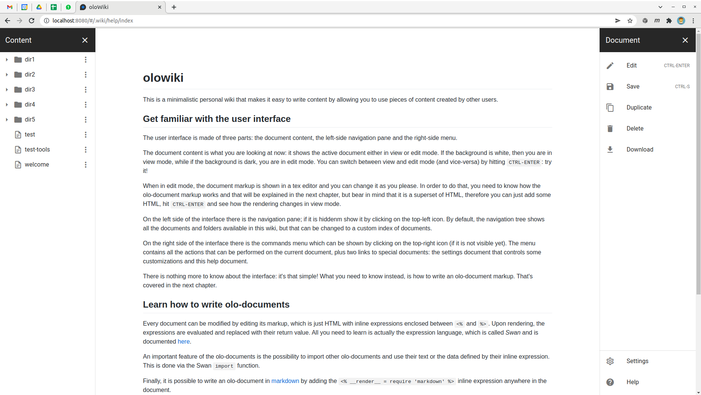
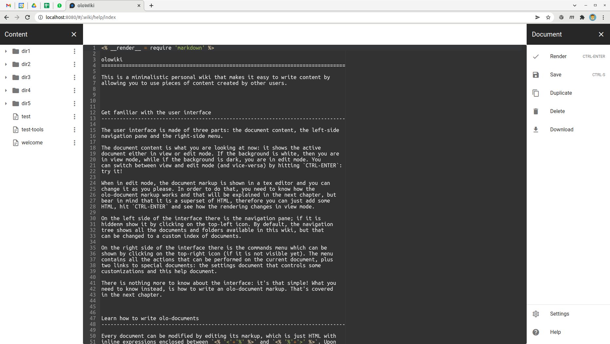
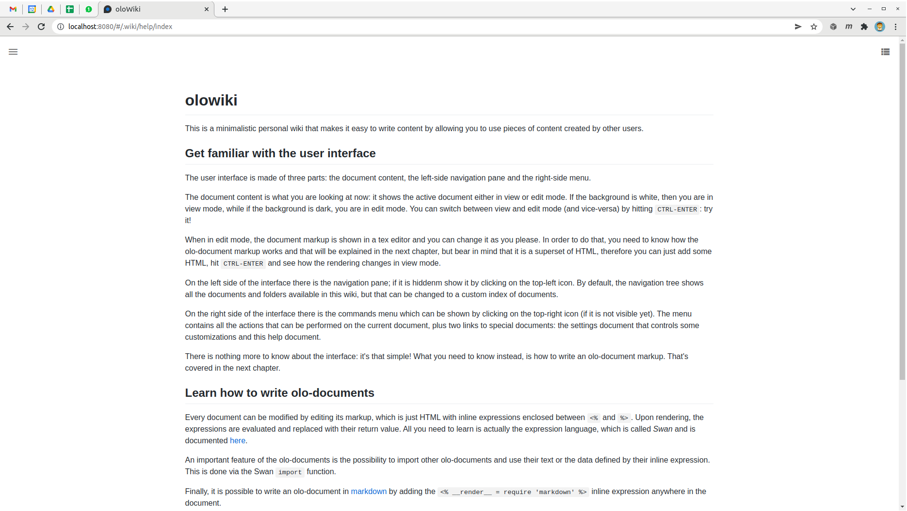
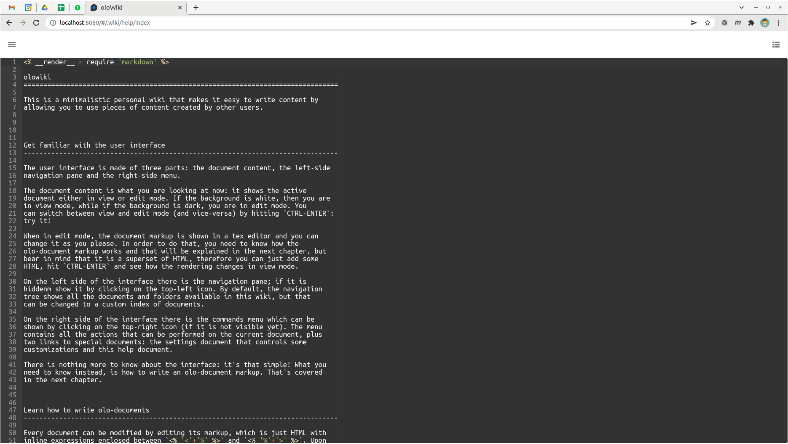

# oloWiki

This is a wiki based on [olojs] documents. 
  
-----
  

*(Screenshot of olowiki in view mode)*

-----


*(Screenshot of olowiki in edit mode)*

-----


*(Screenshot of olowiki in distraction-free view mode)*

-----


*(Screenshot of olowiki in distraction-free edit mode)*

-----
  
Olowiki can be used in two ways:

* By adding oloWiki to [stilo] as plugin and execute `stilo run wiki` at the 
  command line
* By creating an oloWiki HTTP server via JavaScript

Let's explore each of these options.

### The stilo plugin
You can install olowiki as [stilo] plugin and use it to edit your local 
olojs repository in the browser. To do so, first you need to install stilo and 
create a document repository:

```
npm install -g @onlabsorg/stilo
cd /path/to/home
stilo init
```

Then you can add the olowiki plugin to your package:

```
stilo install @onlabsorg/olowiki
```

Once olowiki is installed, you can serve the library as follows:

```
stilo run wiki
```

You can now render and edit the olojs documents contained in `/path/to/home`
in the browser at `http://localhost:8010/#/path/to/doc`.

> The URL hash is interpreted as a document ID, therefore it can also contain
> document arguments. For example: #/path/to/doc?x=10;y=20;z=30


### Create a custom oloWiki server
Another way to use olowiki is by creating a custom wiki server in JavaScript.
First install olojs and olowiki:

```
npm install @onlabsorg/olojs
npm install @onlabsorg/olowiki
```

Then create an olojs store:

```js
olo = require('@onlabsorg/olojs');
store = new olo.FileStore('/path/to/store/directory');    // it can be any store type, not just a FileStore
```

Then create and start the olowiki server:

```js
olowiki = require('@onlabsorg/olowiki');

server = olowiki.Server(store);

server.listen(8010, () => {
    console.log('oloWiki server listening on port 8010');
});
```

You can now render and edit the olojs documents contained in `/path/to/store/directory`
in the browser at `http://localhost:8010/#/path/to/doc`.


### License
This software is released under the [ISC](https://opensource.org/licenses/ISC) 
license.


### Related projects
* [stilo] is a command-line interface written in NodeJS that allows you to
  create and mange local olojs document repositories.
* [olojs] is a distributed content management system


[olojs]: https://github.com/onlabsorg/olojs/blob/master/README.md
[stilo]: https://github.com/onlabsorg/stilo/blob/main/README.md

